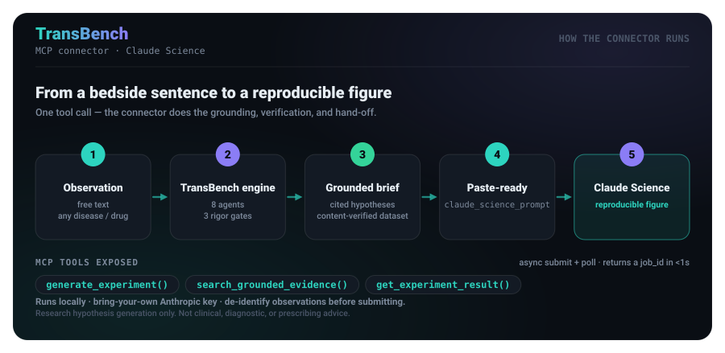
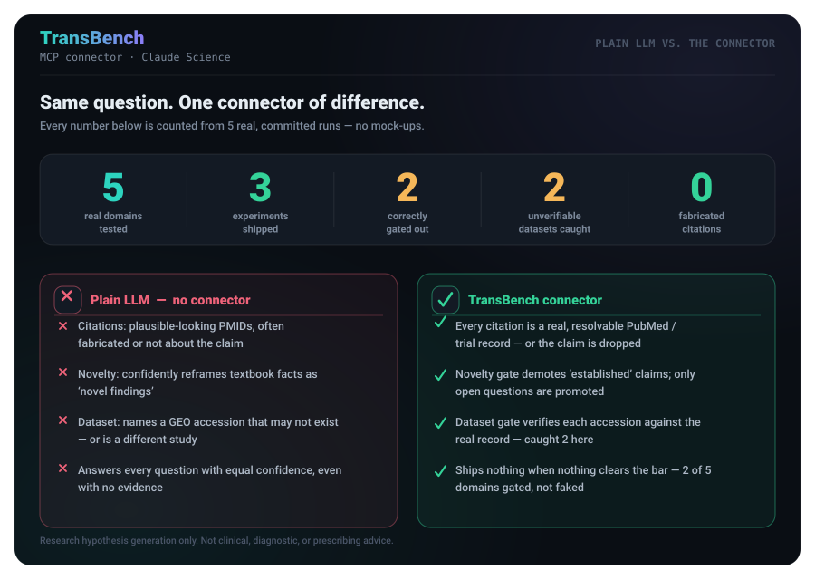
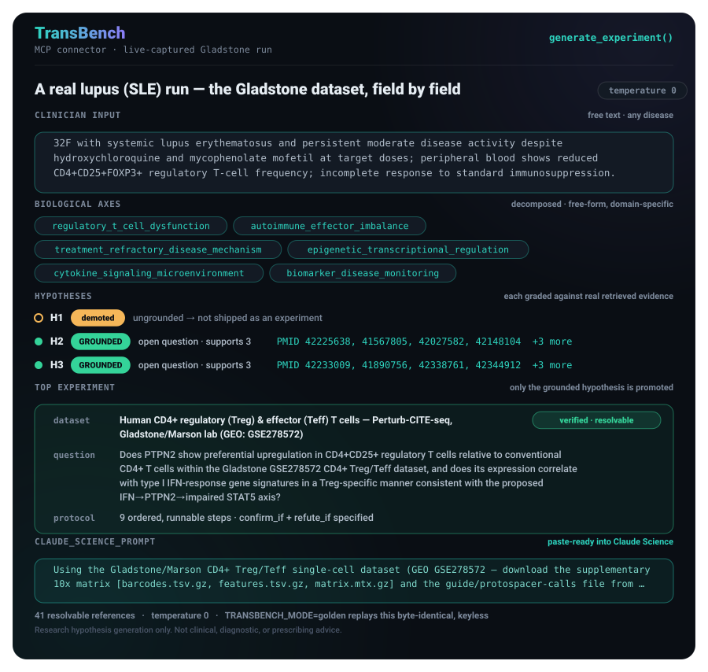
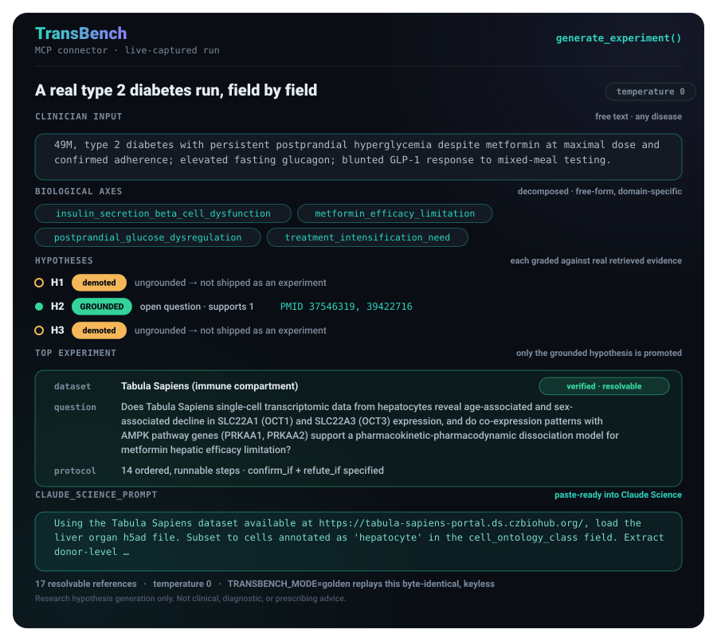
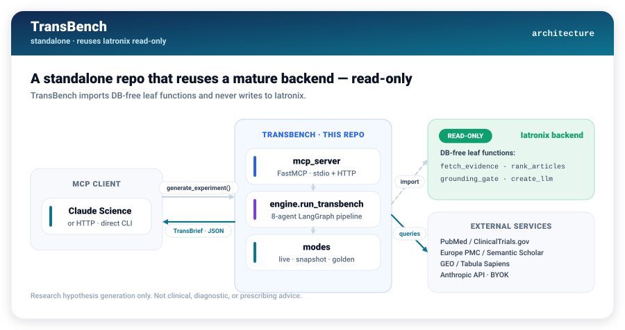

# TransBench

> 🏆 **Built for [Built with Claude: Life Sciences](https://cerebralvalley.ai/e/built-with-claude-life-sciences)** — Anthropic × Gladstone Institutes × Cerebral Valley · **Development Track**
> 👨‍⚕️ **Built by Dr. Kayomarz** — internal-medicine physician & AI engineer · [kayomarz.com](https://kayomarz.com)

**A translational research agent that turns a clinician's bedside observation into a
grounded, testable, bench-ready experiment — shipped as an MCP connector for Claude Science.**

**Why it beats a general chatbot:** it grades every hypothesis against *real* published papers
(PubMed + Europe PMC, resolvable PMIDs), demotes textbook facts so they're never sold as discoveries,
**content-verifies the public dataset it proposes**, and — when the evidence isn't there —
**ships nothing instead of hallucinating a plausible answer. The refusal is the feature.**

You describe something you saw in a patient, in plain words. TransBench breaks it into the
biological mechanisms that could explain it, generates falsifiable hypotheses, **checks each one
against the real published literature**, throws out the textbook facts and the unsupported guesses,
and — for whatever survives — hands you *one runnable computational experiment* with a concrete
public dataset and a paste-ready prompt for Claude Science.

It works for **any** disease, drug, or mechanism — not one fixed specialty. The examples below span
lupus (on the Gladstone dataset), type 2 diabetes, resistant hypertension, melanoma, and rheumatoid
arthritis, and the same pipeline handles whatever you paste in.



> [!IMPORTANT]
> **Research tool only.** TransBench never gives diagnosis, drug selection, or dosing advice. Every
> response carries a fixed disclaimer: *"Research hypothesis generation only. Not clinical,
> diagnostic, or prescribing advice."*

> [!NOTE]
> **Nothing in this README is mocked-up.** Every PMID, count, and experiment on the data cards is read
> straight from real captured runs committed in [`snapshots/`](snapshots/); the flow, pipeline, and
> architecture diagrams encode the system's real structure. All figures are generated deterministically
> by [`docs/generate_readme_assets.py`](docs/generate_readme_assets.py) — anyone can reproduce them
> **byte-identical, with no API key** — see [Reproducibility](#reproducibility--no-fake-data).

---

## 🚀 Install it in one paste — for scientists, no engineering

Want to run it on your **own** cases (not just the demo)? You don't need to be a programmer, and
there are **no servers, domains, or cloud accounts** to set up. If you have
**[Claude Code](https://code.claude.com/docs)**, this is the whole install:

**1. Start Claude Code with Haiku** (fast and inexpensive — it's all this needs):
```bash
claude --model haiku
```
**2. Paste this prompt and press Enter:**
```
Read https://raw.githubusercontent.com/kayomarz97/TransBench/main/INSTALL_AGENT.md
and follow every step exactly to set up TransBench on my computer, then give me the
short steps to connect it in Claude Science. I am not a programmer — explain each step
in one plain sentence, ask me before anything that needs my input, and never print my
API key.
```

That's the whole thing. Claude Code reads one public file — [`INSTALL_AGENT.md`](INSTALL_AGENT.md) — and
does the rest, **the same on macOS and Linux** (it detects your system). It will install the tools it
needs (`git`, `uv`, Python), download TransBench, ask you to put your **own** Anthropic API key in a
private local file (it never sees or prints it), run a free offline self-test to prove the install works,
and finish with a short **"connect it in Claude Science"** card.

Then you get **two ways to use it** — the installer sets up the first and offers the second:
- **Private & local (default):** one command prints a ready-to-paste prompt you drop into a Claude
  Science chat. Nothing is exposed online.
- **As a real connector (optional):** one command opens a temporary secure web address so Claude
  Science's agent can call TransBench directly — **no domain, no Cloudflare account.** It offers
  `cloudflared` (no signup) *or* `ngrok` (stays the same address) and lets you choose.

> **Why Haiku, and why no "effort" setting?** `INSTALL_AGENT.md` is a plain, ordered checklist, so a
> small, cheap model runs it reliably — no bigger model and no "thinking effort" dial needed (Haiku
> doesn't use one). The reproducibility comes from the file, not from the model.

> ⚕️ You'll need your own Anthropic API key (from [console.anthropic.com](https://console.anthropic.com)),
> and — because the reasoning uses Anthropic's cloud API + PubMed — **de-identify** every observation
> first (age band + presentation only; no names, MRNs, or dates).

---

## 🔬 Built with Claude — deeply, not superficially

- **Claude Code** built the whole system — the 8-agent LangGraph engine, the MCP server, and the
  three rigor gates.
- **Claude Science** is the destination: TransBench ships as an MCP **connector** and emits a
  paste-ready `claude_science_prompt` that Claude Science turns into a reproducible figure.
- **Three Claude tiers** run the pipeline — **Opus 4.8** (hypothesize + experiment design, the two
  quality levers), **Sonnet** (decompose + novelty), **Haiku** (grade / entail / assemble).
- **Dataset-agnostic:** it names *and content-verifies* public datasets (GEO, Tabula Sapiens) — and
  **hits this hackathon's Gladstone data directly**: the flagship run ships a PTPN2-in-Tregs
  experiment on **Gladstone's own GSE278572** (Marson-lab Treg/Teff Perturb-CITE-seq), executed
  end-to-end in Claude Science (see [`golden-test-results/`](golden-test-results/)).

---

## 🎥 Demo (3-minute video)

**▶ Watch the walkthrough:** https://youtu.be/RFRhDaPUonE — a real de-identified case → a grounded brief with
live PubMed citations → the experiment run inside Claude Science → and the **honest refusal** when the
evidence is too thin to ship.

**📁 Don't take the video's word for it — verify the results:** the exact run behind this walkthrough
lives in [`golden-test-results/`](golden-test-results/) — TransBench's golden brief **and** the
PTPN2 / type-I-IFN experiment Claude Science actually executed from it (dataset GEO GSE278572), with the
composite figure, the FDR-corrected statistics table, all 41 references, and a `MANIFEST.md` of sha256
checksums for every file. The brief there is **byte-identical** to `snapshots/autoimmune_sle_treg_golden_brief.json`,
so golden mode replays precisely what the video shows.

---

## ⚡ Try it yourself — no API key, two commands

Golden mode replays a real, committed run **byte-for-byte** — nothing to configure, no key, instant:

```bash
git clone https://github.com/kayomarz97/TransBench.git && cd TransBench && uv sync
TRANSBENCH_MODE=golden PYTHONDONTWRITEBYTECODE=1 .venv/bin/python -c "
import asyncio
from transbench.engine import run_transbench
brief = asyncio.run(run_transbench(
    '49M, type 2 diabetes with persistent postprandial hyperglycemia despite metformin at '
    'maximal dose and confirmed adherence; elevated fasting glucagon; blunted GLP-1 response '
    'to mixed-meal testing.'))
print(brief.top_experiment.claude_science_prompt)
"
```

---

## Contents

- [For clinicians — what it does and why it matters](#for-clinicians--what-it-does-and-why-it-matters)
- [How it works](#how-it-works)
- [Without vs. with TransBench](#without-vs-with-transbench)
- [See it in action](#see-it-in-action)
- [Real-world use cases](#real-world-use-cases)
- [For engineers — architecture & internals](#for-engineers--architecture--internals)
- [Install](#install)
- [Run the MCP server & register in Claude Science](#run-the-mcp-server--register-in-claude-science)
- [Modes: live · snapshot · golden](#modes-live--snapshot--golden)
- [Reproducibility — no fake data](#reproducibility--no-fake-data)
- [Reusing Iatronix, read-only](#reusing-iatronix-read-only)
- [Tests](#tests)
- [Repo layout](#repo-layout)
- [Future plans & scalability](#future-plans--scalability)
- [Scope, safety, and status](#scope-safety-and-status)

---

## For clinicians — what it does and why it matters

**The gap it closes.** Every clinic day produces observations that don't fit the guideline —
a patient who doesn't respond to a first-line drug, an unexpected lab, a pattern you can't explain.
Turning that spark into a *testable bench question* normally means days of literature review and a
conversation with a computational biologist. Most sparks never make that trip.

**What TransBench does, in three steps:**

1. **You paste an observation** in plain clinical shorthand — e.g.
   *"52F, rheumatoid arthritis, inadequate response to methotrexate at max dose; persistent
   synovitis; anti-CCP positive."*
2. **It returns a brief.** Candidate mechanisms, each labelled by *how much real published evidence
   actually backs it* (with clickable PubMed / Europe PMC / ClinicalTrials.gov citations), textbook facts flagged
   as "established" (so they're not dressed up as discoveries), and unsupported guesses demoted.
3. **It hands you an experiment.** If a mechanism is both a genuine open question *and* grounded in
   evidence, you get one runnable computational experiment — a named public dataset, an ordered
   protocol, explicit "confirms if / refutes if" criteria, and a prompt you paste straight into
   Claude Science to produce a figure.

**Why it's trustworthy.** The single most important behavior: **when the evidence isn't there,
TransBench says so and ships nothing, rather than inventing a plausible-sounding answer.** In the
five real runs shown below, it produced experiments for three domains and *deliberately declined* for
two — because no hypothesis cleared the evidence bar. That refusal is the feature.

---

## How it works

A clinician's sentence goes in; a grounded, testable brief comes out. Eight cooperating agents do
the work, with three hard quality gates in the middle that anything unsupported cannot pass.


| Stage | Agent | Does |
|---|---|---|
| 1 | Decompose | Splits the observation into biological axes and extracts its own disease anchor (used as the real PubMed search term — so retrieval stays on-topic for *any* domain). |
| 2 | Hypothesize | Writes up to 3 falsifiable mechanistic hypotheses, each naming specific molecules/cells/pathways and a testable prediction. |
| 3 | Retrieve | Writes clean, high-signal search queries per hypothesis (a cheap LLM step, with a heuristic fallback), then pulls real abstracts from **multiple databases** — PubMed + ClinicalTrials.gov (clinical evidence) and **Europe PMC** (mechanism/biology literature; optional Semantic Scholar) — with a dedicated contradiction pass. Escalates through more queries only when a hypothesis is under-grounded, so easy cases stay fast. |
| 4 | Grade | Maps each retrieved source to *supports / refutes* + an evidence grade, and attaches a resolvable citation. Mechanism evidence from a **different disease or model** counts as translational support (the experiment then tests whether it transfers to the patient) — stated in the brief, never hidden. |
| 5–6 | Rigor gates | Entailment (does the source really support it?), grounding (drop anything with no resolvable citation), novelty (demote textbook facts). |
| 7 | Design | Only for a hypothesis that is **both** an open question **and** grounded: one computational experiment on a **content-verified** dataset. |
| 8 | Assemble | Packs everything into a schema-valid `TransBrief` with a full run manifest. |

---

## Without vs. with TransBench

A general-purpose chatbot will happily answer *any* mechanistic question — confidently, with
citations that look real, a "novel" mechanism that's actually in every textbook, and a dataset
accession that may not exist. TransBench is built to make each of those failure modes impossible.
The numbers below are counted from the five real runs in [`snapshots/`](snapshots/):



| | Plain LLM (no connector) | **TransBench connector** |
|---|---|---|
| **Citations** | Plausible-looking PMIDs, often fabricated | Every citation is a real, resolvable record — or the claim is dropped |
| **Novelty** | Reframes textbook facts as "novel" | `established` claims demoted; only open questions promoted |
| **Datasets** | Names an accession that may not exist / be a different study | **Verifies each proposed accession** against the real record; rejects & replaces if it can't |
| **When ungrounded** | Answers anyway, confidently | **Ships nothing** — an honest refusal |
| **Reproducible** | New answer every time | `TRANSBENCH_MODE=golden` replays byte-identical, keyless |

The **2 unverifiable datasets caught** are real, and the gate rejects for different reasons: in the
hypertension run the model proposed a GEO accession, the gate fetched the actual record and found it
was a *kidney-transplant chimerism* study — wrong content — and rejected it; in the diabetes run the
proposed pointer wasn't even a well-formed reference to a public dataset host. Both fell back to a
pinned, guaranteed-resolvable atlas, recorded transparently in the brief's `feasibility_notes`.

---

## See it in action

**The Gladstone run — a real, live-captured lupus (SLE) case.** Every field below is served verbatim
from [`snapshots/autoimmune_sle_treg_golden_brief.json`](snapshots/autoimmune_sle_treg_golden_brief.json)
— the same brief drives the experiment Claude Science actually executed in
[`golden-test-results/`](golden-test-results/).



The proposed substrate is **Gladstone's own dataset, GSE278572** (Marson-lab Treg/Teff
Perturb-CITE-seq), and the shipped experiment probes **PTPN2 in CD4+ regulatory vs conventional
T cells** with a type-I-interferon / STAT5 read-out — grounded in **41 real citations**.

Reproduce it yourself in seconds — **no API key needed** (golden mode replays the committed brief):

```bash
TRANSBENCH_MODE=golden PYTHONDONTWRITEBYTECODE=1 .venv/bin/python -c "
import asyncio
from transbench.engine import run_transbench
brief = asyncio.run(run_transbench(
    '32F with systemic lupus erythematosus and persistent moderate disease activity despite '
    'hydroxychloroquine and mycophenolate mofetil at target doses; peripheral blood shows reduced '
    'CD4+CD25+FOXP3+ regulatory T-cell frequency; incomplete response to standard immunosuppression.'))
print(brief.top_experiment.claude_science_prompt)
"
```

**A second domain — type 2 diabetes.** Every field below is served verbatim from
[`snapshots/metabolic_t2d_golden_brief.json`](snapshots/metabolic_t2d_golden_brief.json):



*(The experiment targets hepatocytes; Tabula Sapiens is a whole-body atlas, so the single download
named in the prompt includes the liver/hepatocyte cells — `(immune compartment)` is just the pinned
fallback's default label.)*

Reproduce it yourself in seconds — **no API key needed** (golden mode replays the committed brief):

```bash
TRANSBENCH_MODE=golden PYTHONDONTWRITEBYTECODE=1 .venv/bin/python -c "
import asyncio
from transbench.engine import run_transbench
brief = asyncio.run(run_transbench(
    '49M, type 2 diabetes with persistent postprandial hyperglycemia despite metformin at '
    'maximal dose and confirmed adherence; elevated fasting glucagon; blunted GLP-1 response '
    'to mixed-meal testing.'))
print(brief.top_experiment.claude_science_prompt)
"
```

The same command works across all **five** committed domains — **lupus, resistant hypertension,
type 2 diabetes, melanoma, and rheumatoid arthritis** — golden mode auto-selects the matching
committed brief by the observation text (see [Modes](#modes-live--snapshot--golden)). Melanoma and RA
return **no experiment** on purpose: no hypothesis cleared the grounding bar, so the tool declined
rather than fabricate one.

---

## Real-world use cases

Framed as *what you'd actually do with it* — grounded in the five domains already captured here, and
generalizable to any PubMed-covered area.

- **Bench-directing a treatment non-responder.** *T2D not controlled on metformin* → TransBench
  grounds a metformin-transporter (OCT1/OCT3) pharmacokinetic-dissociation hypothesis and returns a
  single-cell experiment on hepatocyte transporter expression — a concrete next question for a lab,
  not a literature dump.
- **Explaining a paradoxical case.** *Resistant hypertension despite triple therapy* → an
  aldosterone-independent WNK–SPAK–ENaC compensation hypothesis, grounded in real Gitelman-syndrome
  literature (PMIDs 28003083, 25841442), with a distal-tubule co-expression experiment.
- **Directing an autoimmune case to a specific gene in a specific dataset.** *Lupus with low
  regulatory T-cells despite standard immunosuppression* → TransBench grounds a **PTPN2 / type-I-IFN**
  hypothesis and returns a Treg-vs-Teff single-cell experiment on **Gladstone's GSE278572**, with
  confirm/refute criteria and 41 citations attached — the exact run captured in
  [`golden-test-results/`](golden-test-results/).
- **Triaging what's worth studying.** *Melanoma progressing on checkpoint blockade* and
  *methotrexate-refractory RA* → the tool retrieves the literature, finds no generated hypothesis is
  both novel and sufficiently grounded, and **ships no experiment** — telling you the easy
  mechanistic story isn't actually supported yet, which is itself the useful signal.
- **A safe front door to computational biology.** The output is a `claude_science_prompt` that a
  non-programmer clinician pastes into Claude Science to get a figure — the connector does the
  translational-informatics legwork, with citations and refutation criteria attached.

**Honest scope.** "Universal" means *any clinical/biomedical observation* — this is a PubMed +
Europe PMC + single-cell-atlas research tool, not a general non-medical engine. Some areas legitimately have
sparser literature for a freshly-generated novel hypothesis; the same gates that demote a thin
hypothesis in one domain apply identically everywhere, which is why two of five domains here
produced no experiment.

---

## For engineers — architecture & internals

### Architecture

TransBench is a **standalone repo** that reuses the mature grounding/retrieval stack of the
**[Iatronix](https://github.com/kayomarz97/iatronix)** backend ([med.kayomarz.com](https://med.kayomarz.com)) as a **read-only** dependency — it imports DB-free leaf functions and never
modifies Iatronix (enforced by a baseline-diff guard).



### The reuse seam

A single module, [`src/transbench/reuse.py`](src/transbench/reuse.py), imports only DB-free leaves —
`fetch_evidence_data`, `fetch_drug_data`, `rank_article_list`, `build_article_registry`,
`grounding_stats`/`strip_ungrounded`, `has_minimum_evidence`/`ensure_evidence`, `validate_citations`,
`create_llm`, `neutralize_query`. It never imports `run_search_graph`, `semantic_cache`, or
`vector_search` (those need pgvector/redis). Iatronix is installed **editable** (`uv pip install -e
<IATRONIX>/backend --no-deps`) so `from app.services… import …` resolves to the live source tree with
nothing written back.

### Data contract

The engine returns a schema-valid `TransBrief` ([`src/transbench/schemas.py`](src/transbench/schemas.py),
Pydantic v2): `request_echo`, `axes[]`, `hypotheses[]` (each with `evidence[]`, `supporting_count`,
`novelty`, `grounded`, `confidence`), `top_experiment` (`dataset`, `dataset_pointer`,
`protocol_steps[]`, `confirm_if`, `refute_if`, `claude_science_prompt`), deduplicated `references[]`,
`contradictions_surfaced[]`, `uncertainty_note`, and a `run_manifest` (models, temperature, caps,
per-hypothesis retrieval snapshot, token spend, timestamps). `axes` are free-form normalized
snake_case strings, so any domain names its own mechanisms.

### Determinism

`temperature = 0` everywhere, belt-and-suspenders: the reused `create_llm` has no temperature
parameter (it builds at `settings.llm_temperature`), so we set `LLM_TEMPERATURE=0` in the env **and**
`.bind(temperature=0)` on every client. `temperature=0` does not make live PubMed or the LLM
bit-identical, so the *reproducible artifact* is the experiment (named dataset + protocol +
`claude_science_prompt`) — and golden mode makes the whole brief exactly reproducible.

### MCP server

[`mcp_server/server.py`](mcp_server/server.py) is a FastMCP server (`mcp==1.28.1`) exposing three tools
over **streamable-HTTP** (how Claude Science connects — as a local URL connector, `localhost:8500`)
and **stdio** (for direct/embedded use). A run legitimately takes ~60–120s (longer cold), beyond an MCP
client's single-call wait-for-result timeout, so the two generators are **async (submit + poll)**:

- **`generate_experiment(observation, focus_drug="")`** — starts the run, returns a `job_id` in <1s;
  the finished payload is the full grounded `TransBrief`.
- **`search_grounded_evidence(question)`** — same engine run, returns a `job_id`; finished payload is a
  lighter grounded-evidence projection.
- **`get_experiment_result(job_id)`** — poll (<1s each) until `status` is `"done"` (payload in
  `result`) or `"error"`, so no single call ever nears the client timeout however long the run takes.

Both generators call `engine.run_transbench` directly (no duplicated logic) and catch `create_llm`'s
`fastapi.HTTPException` (missing/invalid key, bad model) to return a clean structured error.

### Cost

Per run ≈ 1 decompose + 1 hypothesize + 3 grade + 3 entailment + 3 novelty + 1 design + 1 assemble
(+ ≤3 short neutralize calls) ≈ **~13 LLM calls** across three tiers — **Haiku** (grade / entail /
assemble / neutralize), **Sonnet** (decompose / novelty), and **Opus** (`MODEL_DEEP`: hypothesize +
experiment-design — the two quality levers) — plus live PubMed and one GEO content-verification fetch.
Opus lifts per-run cost, but grading (the many-call step) stays on Haiku so it's bounded; set
`MODEL_DEEP=claude-sonnet-4-6` to run without Opus. Hypotheses are capped at 3, abstracts at
8/hypothesis, fan-out concurrency at 3.

---

## Install

Requires **Python ≥ 3.11** and [`uv`](https://docs.astral.sh/uv/).

```bash
git clone <repo> && cd transbench
uv sync                                  # installs everything; runs on the vendored Iatronix copy
                                         # (src/vendored/) — no external med-ai-project needed

# (optional) develop against the LIVE Iatronix source instead of src/vendored/
# (Path A, REUSE_SOURCE=installed_iatronix):
uv pip install --no-deps -e /path/to/med-ai-project/backend
```

Copy `.env.example` to `.env` and fill in your own keys — **never commit real keys** (`.env` is
gitignored):

| Key | Required | Purpose |
|---|---|---|
| `ANTHROPIC_API_KEY` | yes (for live runs) | BYOK key for the engine's own Anthropic calls. Claude Science never sees it. Not needed for `golden` mode. |
| `PUBMED_API_KEY` | no | Raises NCBI/PubMed rate limits. |
| `LLM_TEMPERATURE` | `=0` | Forces deterministic clients (belt 1 of 2). |
| `PYTHONDONTWRITEBYTECODE` | `=1` | Keeps imports from writing `.pyc` into the read-only Iatronix tree. |
| `MODEL_DEEP` | no | Deep-reasoning model for hypothesize + experiment-design. Defaults to the Sonnet reasoning tier; `run_http.sh` sets `claude-opus-4-8`. Set `=claude-sonnet-4-6` to run without Opus. |
| `PROVIDERS_CONFIG_PATH` | no | Points the LLM provider registry at `config/providers.yaml` (Anthropic Haiku/Sonnet/Opus). Set when `MODEL_DEEP` uses Opus (`run_http.sh` does this). |

---

## Use it with Claude Science (fully local)

The private, local way is to use TransBench **alongside** Claude Science — one command gives you a
grounded brief plus a paste-ready prompt:

```bash
bash mcp_server/ask.sh "33F, resistant hypertension on telmisartan + thiazide + CCB; raised CRP"
```
Copy the printed **`claude_science_prompt`** block into a Claude Science chat → CS loads the dataset
and produces the reproducible figure. Nothing is exposed on a network.

> **Prefer a real connector (CS agent calls the tool)?** CS's **Local command** connector can't work
> for a tool that itself calls an LLM (its sandbox returns `403` for `api.anthropic.com` → the 402/403
> wall), and **Remote** requires a *public https* URL (`safeFetch` rejects `http://` + localhost). So
> expose the local server at a **private HTTPS URL** via a tunnel — nginx + Cloudflare (proxied origin,
> secret-path, origin locked to Cloudflare IPs) or `cloudflared`. Standalone **"set up your own tunnel"**
> guide + the one gotcha (`proxy_set_header Host 127.0.0.1:8500` — TransBench rejects other Hosts) is in
> **[`CLAUDE_SCIENCE_SETUP.md`](CLAUDE_SCIENCE_SETUP.md)**.

> ⚕️ **Healthcare note:** TransBench is not offline — reasoning is Anthropic's cloud API and it
> queries PubMed, so submitted observation text is sent to Anthropic's API. **De-identify before
> submitting.** The server/orchestration stay local; the LLM does not.

---

## Modes: live · snapshot · golden

`TRANSBENCH_MODE` (read from the process env inside `run_transbench`, so it applies to every caller
including the MCP tools) toggles how output is sourced:

| Mode | Behavior |
|---|---|
| `live` (default) | The full 8-agent pipeline. |
| `golden` | Returns a pre-captured `TransBrief` **verbatim** — deterministic, keyless replay. |
| `snapshot` | Runs the **real** pipeline but replays PubMed retrieval from a bundled snapshot (fixed evidence, live reasoning). |

**Golden mode auto-selects.** With `TRANSBENCH_GOLDEN_BRIEF` unset, golden mode scans
`snapshots/*_golden_brief.json` and serves the one whose `request_echo` matches your observation
(normalized) — so the committed hypertension, diabetes, melanoma, and RA briefs all "just work", and
dropping in a new domain golden needs **zero code changes**. Setting `TRANSBENCH_GOLDEN_BRIEF`
explicitly pins a single file (legacy behavior). Either way, a brief is only ever served for a
matching observation — a mismatch transparently falls back to the live pipeline, so golden mode can
**never** serve the wrong brief.

---

## Reproducibility — no fake data

- **Everything shown is real.** The data cards' numbers come from committed `snapshots/*.json`; the
  flow / pipeline / architecture diagrams encode the real system structure. All figures regenerate
  offline via `python docs/generate_readme_assets.py`.
- **Anyone reproduces the demos, free.** `TRANSBENCH_MODE=golden` replays the committed briefs
  byte-identical with no API key.
- **Live results are close, not identical.** Live runs re-derive results against *today's* PubMed, so
  citations shift as the literature grows — the same observation gives close-enough results for
  anyone, and the *experiment* (named dataset + protocol + prompt) is the durable, rerunnable
  artifact. Every run records its models, queries, PMIDs, and dataset pointer in `run_manifest`.

---

## Reusing Iatronix, read-only

TransBench never edits Iatronix. A **baseline-diff guard**
([`tests/test_iatronix_untouched.py`](tests/test_iatronix_untouched.py), run under
`PYTHONDONTWRITEBYTECODE=1`) snapshots `git -C <IATRONIX_PATH> status --porcelain` at the start of
every test session and hard-fails on any new delta (not an absolute-empty assertion — Iatronix
legitimately carries unrelated untracked files). Verified clean across every phase of this build,
including every live pipeline run.

---

## Tests

**213 tests across 16 modules** — mostly fully offline/deterministic (fake-LLM doubles, pure
functions, or free NCBI-only calls). The handful of live Anthropic tests share **one** flagship
pipeline run via a session-scoped fixture and skip cleanly without a key:

```bash
PYTHONDONTWRITEBYTECODE=1 .venv/bin/python -m pytest -q tests/
```

The load-bearing guards: `test_iatronix_untouched` (read-only enforcement), `test_grounding` +
`test_novelty` (the rigor gates), `test_universal_domains` (every PubMed query anchors on the
observation's *own* disease, never "hypertension"), `test_snapshot_toggle` (live/golden/snapshot +
golden auto-select), `test_mcp_parity` (the MCP tools faithfully pass the engine's brief), and
`test_cost` (≤3 hypotheses, batched entailment). Per-phase acceptance tests cover
decompose→assemble.

---

## Repo layout

```
transbench/
├─ src/transbench/       # config, schemas, prompts, reuse seam, 8 agents, rigor, LangGraph engine
├─ mcp_server/           # FastMCP server (stdio + HTTP), run scripts, connector manifest
├─ snapshots/            # 5 committed golden briefs (lupus/Gladstone, hypertension, T2D, melanoma, RA) + retrieval snapshot
├─ golden-test-results/  # the flagship Gladstone run: TransBrief + the PTPN2 / GSE278572 experiment Claude Science executed, with a sha256 MANIFEST
├─ docs/                 # generate_readme_assets.py + img/ (SVG cards & diagrams, generated offline)
├─ tests/                # fixtures + 213-test suite (16 modules)
├─ config/               # LLM provider registry (providers.yaml: Anthropic Haiku/Sonnet/Opus)
├─ scripts/              # offline-bench.sh — the keyless, deterministic bench
├─ INSTALL_AGENT.md      # one-paste installer for non-engineer scientists
├─ .claude/  .githooks/  # agent playbook & config + the pre-push secret-scan hook
├─ BUILD_SPEC.md         # full design spec        KICKOFF.md  # phase-by-phase build plan
├─ CLAUDE_SCIENCE_SETUP.md   PLAN.md   CLAUDE.md   .env.example
```

---

## Future plans & scalability

> **Roadmap — not shipped yet.** TransBench today is a single-run connector. The items below turn it
> into a durable, multi-user, clinic-ready tool. None of them change the current engine's behaviour or
> its safety posture: each is **additive**, built the same way the core was (plan first, verify-gated),
> and stays **standalone** — it never touches Iatronix.

**Text it like you'd text a colleague — Slack, WhatsApp, Telegram, or any messaging app.**
A clinician shouldn't need a terminal. *In plain terms:* send an observation from the messaging app you
already use, and the grounded brief comes back as a reply. *Technically:* a thin, stateless gateway maps
an inbound message to `generate_experiment` (async submit + poll) and formats the returned `TransBrief`
back — the engine is unchanged, because it already speaks MCP over HTTP.

**Batch processing.**
*In plain terms:* hand it a whole list — a clinic's backlog of interesting cases — and get a brief for
each, overnight. *Technically:* a queue in front of the existing async job API, fanning out under the
current concurrency caps, deduplicated by observation hash, resumable, with results written to the brief
store below. It reuses the submit/poll design; no run logic is duplicated.

**Scrub patient identifiers before anything is stored (de-identify on input).**
This is the single biggest gate between a demo and a real clinic deployment. *In plain terms:* before a
single word is saved or sent, names, MRNs, dates, and other identifiers are stripped, so only the
de-identified clinical picture is ever kept. *Technically:* a de-identification guard at the ingress
boundary (PHI/PII detection + redaction) that runs **before** persistence and before any model call;
only de-identified text plus a one-way hash (for deduplication) is ever stored.

**Healthcare-grade compliance.**
*In plain terms:* the guardrails a hospital needs before it will trust a tool. *Technically:* encryption
at rest and in transit, per-user authentication and access control, an immutable audit log (the
`run_manifest` is already an audit seed), data-retention controls, and signed agreements (BAAs) with
every processor (model provider, hosting) — with region-pinning and no-training guarantees on any
PHI-adjacent path.

**Persistence — from a one-shot tool into a compounding knowledge asset.**
*In plain terms:* save every brief so the tool remembers, spots duplicates, and can tell you later when
new evidence appears. *Technically:* an append-only, content-hash-keyed brief store with two derived
indexes — relational/JSONB for filtering and a small vector index over observations and hypotheses for
semantic dedup. It gets its **own** lightweight store and never reuses the Iatronix database. This
unlocks:

- **Re-grounding watchlist** — a stored hypothesis becomes a standing query; retrieval re-runs on a
  schedule and the messaging front-door notifies you when a previously-ungrounded question finally
  clears the evidence bar.
- **Institutional memory & portfolio view** — a lab accumulates a searchable corpus of
  observation → hypothesis → experiment, and a PI sees every generated experiment ranked by
  grounding / novelty / feasibility.
- **Feedback loop** — capture which experiments were actually run and whether they confirmed or refuted,
  to finally measure the tool's real hit-rate.

**Meet teams where they already work.**
*In plain terms:* drop briefs straight into the tools labs already use. *Technically:* export to an ELN
(Benchling / LabArchives), a "hypothesis backlog" in an issue tracker or Notion, and an optional
read-only dashboard over the store.

**Phased rollout:** **A** persist + de-identification guard → **B** semantic search & dedup →
**C** re-grounding watchlist → **D** portfolio & feedback → **E** integrations, messaging, and batch.

> The honest caveats carry forward at every phase: TransBench generates **hypotheses, not answers**;
> **grounded ≠ correct**; it is **not clinical**; and sparse domains legitimately yield less.

---

## Scope, safety, and status

Complete and shipped. `generate_experiment` returns a grounded, cited `TransBrief` whose
`top_experiment` is a runnable single-cell analysis naming a content-verified, resolvable dataset
with a `claude_science_prompt`; the MCP server serves it over streamable-HTTP (what Claude Science
connects to, via a private https tunnel) and stdio (direct clients); the pipeline is domain-universal;
the Iatronix baseline-diff guard shows no new delta. Claude Science actually *executing* a prompt is a
demo-day path (the beta app, external to this repo), with the local `ask.sh` + manual-paste fallback above.

> **Research hypothesis generation only. Not clinical, diagnostic, or prescribing advice.**
