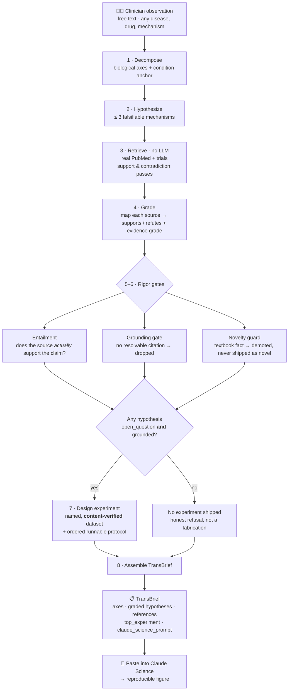
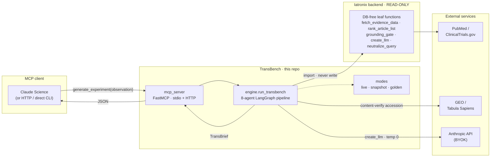

# TransBench

**A translational research agent that turns a clinician's bedside observation into a
grounded, testable, bench-ready experiment — shipped as an MCP connector for Claude Science.**

You describe something you saw in a patient, in plain words. TransBench breaks it into the
biological mechanisms that could explain it, generates falsifiable hypotheses, **checks each one
against the real published literature**, throws out the textbook facts and the unsupported guesses,
and — for whatever survives — hands you *one runnable computational experiment* with a concrete
public dataset and a paste-ready prompt for Claude Science.

It works for **any** disease, drug, or mechanism — not one fixed specialty. The examples below span
type 2 diabetes, resistant hypertension, melanoma, and rheumatoid arthritis, and the same pipeline
handles whatever you paste in.

> [!IMPORTANT]
> **Research tool only.** TransBench never gives diagnosis, drug selection, or dosing advice. Every
> response carries a fixed disclaimer: *"Research hypothesis generation only. Not clinical,
> diagnostic, or prescribing advice."*

> [!NOTE]
> **Nothing in this README is mocked-up.** Every screenshot, PMID, count, and experiment is read
> straight from real captured runs committed in [`snapshots/`](snapshots/). The images are generated
> from those files by [`docs/generate_readme_assets.py`](docs/generate_readme_assets.py). Anyone can
> reproduce them **byte-identical, with no API key** — see [Reproducibility](#reproducibility--no-fake-data).

---

## Contents

- [For clinicians — what it does and why it matters](#for-clinicians--what-it-does-and-why-it-matters)
- [How it works](#how-it-works)
- [Without vs. with TransBench](#without-vs-with-transbench)
- [See it in action](#see-it-in-action)
- [Real-world use cases](#real-world-use-cases)
- [For engineers — architecture & internals](#for-engineers--architecture--internals)
- [Install](#install)
- [Run the MCP server & register in Claude Science](#run-the-mcp-server--register-in-claude-science)
- [Modes: live · snapshot · golden](#modes-live--snapshot--golden)
- [Reproducibility — no fake data](#reproducibility--no-fake-data)
- [Reusing Iatronix, read-only](#reusing-iatronix-read-only)
- [Tests](#tests)
- [Repo layout](#repo-layout)
- [Scope, safety, and status](#scope-safety-and-status)

---

## For clinicians — what it does and why it matters

**The gap it closes.** Every clinic day produces observations that don't fit the guideline —
a patient who doesn't respond to a first-line drug, an unexpected lab, a pattern you can't explain.
Turning that spark into a *testable bench question* normally means days of literature review and a
conversation with a computational biologist. Most sparks never make that trip.

**What TransBench does, in three steps:**

1. **You paste an observation** in plain clinical shorthand — e.g.
   *"52F, rheumatoid arthritis, inadequate response to methotrexate at max dose; persistent
   synovitis; anti-CCP positive."*
2. **It returns a brief.** Candidate mechanisms, each labelled by *how much real published evidence
   actually backs it* (with clickable PubMed / ClinicalTrials.gov citations), textbook facts flagged
   as "established" (so they're not dressed up as discoveries), and unsupported guesses demoted.
3. **It hands you an experiment.** If a mechanism is both a genuine open question *and* grounded in
   evidence, you get one runnable computational experiment — a named public dataset, an ordered
   protocol, explicit "confirms if / refutes if" criteria, and a prompt you paste straight into
   Claude Science to produce a figure.

**Why it's trustworthy.** The single most important behavior: **when the evidence isn't there,
TransBench says so and ships nothing, rather than inventing a plausible-sounding answer.** In the
four real runs shown below, it produced experiments for two domains and *deliberately declined* for
two — because no hypothesis cleared the evidence bar. That refusal is the feature.

---

## How it works

A clinician's sentence goes in; a grounded, testable brief comes out. Eight cooperating agents do
the work, with three hard quality gates in the middle that anything unsupported cannot pass.



| Stage | Agent | Does |
|---|---|---|
| 1 | Decompose | Splits the observation into biological axes and extracts its own disease anchor (used as the real PubMed search term — so retrieval stays on-topic for *any* domain). |
| 2 | Hypothesize | Writes up to 3 falsifiable mechanistic hypotheses, each naming specific molecules/cells/pathways and a testable prediction. |
| 3 | Retrieve | **No LLM.** Pulls real PubMed + ClinicalTrials.gov abstracts, with a dedicated contradiction pass, per hypothesis. |
| 4 | Grade | Maps each retrieved source to *supports / refutes* + an evidence grade, and attaches a resolvable citation. |
| 5–6 | Rigor gates | Entailment (does the source really support it?), grounding (drop anything with no resolvable citation), novelty (demote textbook facts). |
| 7 | Design | Only for a hypothesis that is **both** an open question **and** grounded: one computational experiment on a **content-verified** dataset. |
| 8 | Assemble | Packs everything into a schema-valid `TransBrief` with a full run manifest. |

---

## Without vs. with TransBench

A general-purpose chatbot will happily answer *any* mechanistic question — confidently, with
citations that look real, a "novel" mechanism that's actually in every textbook, and a dataset
accession that may not exist. TransBench is built to make each of those failure modes impossible.
The numbers below are counted from the four real runs in [`snapshots/`](snapshots/):


| | Plain LLM (no connector) | **TransBench connector** |
|---|---|---|
| **Citations** | Plausible-looking PMIDs, often fabricated | Every citation is a real, resolvable record — or the claim is dropped |
| **Novelty** | Reframes textbook facts as "novel" | `established` claims demoted; only open questions promoted |
| **Datasets** | Names an accession that may not exist / be a different study | **Verifies each proposed accession** against the real record; rejects & replaces if it can't |
| **When ungrounded** | Answers anyway, confidently | **Ships nothing** — an honest refusal |
| **Reproducible** | New answer every time | `TRANSBENCH_MODE=golden` replays byte-identical, keyless |

The **2 unverifiable datasets caught** are real, and the gate rejects for different reasons: in the
hypertension run the model proposed a GEO accession, the gate fetched the actual record and found it
was a *kidney-transplant chimerism* study — wrong content — and rejected it; in the diabetes run the
proposed pointer wasn't even a well-formed reference to a public dataset host. Both fell back to a
pinned, guaranteed-resolvable atlas, recorded transparently in the brief's `feasibility_notes`.

---

## See it in action

Real, live-captured output for a **type 2 diabetes** observation — every field below is served
verbatim from [`snapshots/metabolic_t2d_golden_brief.json`](snapshots/metabolic_t2d_golden_brief.json):


*(The experiment targets hepatocytes; Tabula Sapiens is a whole-body atlas, so the single download
named in the prompt includes the liver/hepatocyte cells — `(immune compartment)` is just the pinned
fallback's default label.)*

Reproduce it yourself in seconds — **no API key needed** (golden mode replays the committed brief):

```bash
TRANSBENCH_MODE=golden PYTHONDONTWRITEBYTECODE=1 .venv/bin/python -c "
import asyncio
from transbench.engine import run_transbench
brief = asyncio.run(run_transbench(
    '49M, type 2 diabetes with persistent postprandial hyperglycemia despite metformin at '
    'maximal dose and confirmed adherence; elevated fasting glucagon; blunted GLP-1 response '
    'to mixed-meal testing.'))
print(brief.top_experiment.claude_science_prompt)
"
```

The same command works for **resistant hypertension**, **melanoma**, and **rheumatoid arthritis** —
golden mode auto-selects the matching committed brief by the observation text (see
[Modes](#modes-live--snapshot--golden)). Melanoma and RA return **no experiment** on purpose: no
hypothesis cleared the grounding bar, so the tool declined rather than fabricate one.

---

## Real-world use cases

Framed as *what you'd actually do with it* — grounded in the four domains already captured here, and
generalizable to any PubMed-covered area.

- **Bench-directing a treatment non-responder.** *T2D not controlled on metformin* → TransBench
  grounds a metformin-transporter (OCT1/OCT3) pharmacokinetic-dissociation hypothesis and returns a
  single-cell experiment on hepatocyte transporter expression — a concrete next question for a lab,
  not a literature dump.
- **Explaining a paradoxical case.** *Resistant hypertension despite triple therapy* → an
  aldosterone-independent WNK–SPAK–ENaC compensation hypothesis, grounded in real Gitelman-syndrome
  literature (PMIDs 28003083, 25841442), with a distal-tubule co-expression experiment.
- **Triaging what's worth studying.** *Melanoma progressing on checkpoint blockade* and
  *methotrexate-refractory RA* → the tool retrieves the literature, finds no generated hypothesis is
  both novel and sufficiently grounded, and **ships no experiment** — telling you the easy
  mechanistic story isn't actually supported yet, which is itself the useful signal.
- **A safe front door to computational biology.** The output is a `claude_science_prompt` that a
  non-programmer clinician pastes into Claude Science to get a figure — the connector does the
  translational-informatics legwork, with citations and refutation criteria attached.

**Honest scope.** "Universal" means *any clinical/biomedical observation* — this is a PubMed +
single-cell-atlas research tool, not a general non-medical engine. Some areas legitimately have
sparser literature for a freshly-generated novel hypothesis; the same gates that demote a thin
hypothesis in one domain apply identically everywhere, which is why two of four domains here
produced no experiment.

---

## For engineers — architecture & internals

### Architecture

TransBench is a **standalone repo** that reuses the mature grounding/retrieval stack of the
**Iatronix** backend as a **read-only** dependency — it imports DB-free leaf functions and never
modifies Iatronix (enforced by a baseline-diff guard).



### The reuse seam

A single module, [`src/transbench/reuse.py`](src/transbench/reuse.py), imports only DB-free leaves —
`fetch_evidence_data`, `fetch_drug_data`, `rank_article_list`, `build_article_registry`,
`grounding_stats`/`strip_ungrounded`, `has_minimum_evidence`/`ensure_evidence`, `validate_citations`,
`create_llm`, `neutralize_query`. It never imports `run_search_graph`, `semantic_cache`, or
`vector_search` (those need pgvector/redis). Iatronix is installed **editable** (`uv pip install -e
<IATRONIX>/backend --no-deps`) so `from app.services… import …` resolves to the live source tree with
nothing written back.

### Data contract

The engine returns a schema-valid `TransBrief` ([`src/transbench/schemas.py`](src/transbench/schemas.py),
Pydantic v2): `request_echo`, `axes[]`, `hypotheses[]` (each with `evidence[]`, `supporting_count`,
`novelty`, `grounded`, `confidence`), `top_experiment` (`dataset`, `dataset_pointer`,
`protocol_steps[]`, `confirm_if`, `refute_if`, `claude_science_prompt`), deduplicated `references[]`,
`contradictions_surfaced[]`, `uncertainty_note`, and a `run_manifest` (models, temperature, caps,
per-hypothesis retrieval snapshot, token spend, timestamps). `axes` are free-form normalized
snake_case strings, so any domain names its own mechanisms.

### Determinism

`temperature = 0` everywhere, belt-and-suspenders: the reused `create_llm` has no temperature
parameter (it builds at `settings.llm_temperature`), so we set `LLM_TEMPERATURE=0` in the env **and**
`.bind(temperature=0)` on every client. `temperature=0` does not make live PubMed or the LLM
bit-identical, so the *reproducible artifact* is the experiment (named dataset + protocol +
`claude_science_prompt`) — and golden mode makes the whole brief exactly reproducible.

### MCP server

[`mcp_server/server.py`](mcp_server/server.py) is a FastMCP server (`mcp==1.28.1`) exposing two tools
over **streamable-HTTP** (how Claude Science connects — as a local URL connector, `localhost:8500`)
and **stdio** (for direct/embedded use):

- **`generate_experiment(observation, focus_drug="")`** — the full grounded `TransBrief`.
- **`search_grounded_evidence(question)`** — the same engine run, reshaped into a lighter
  grounded-evidence projection.

Both call `engine.run_transbench` directly (no duplicated logic) and catch `create_llm`'s
`fastapi.HTTPException` (missing/invalid key, bad model) to return a clean structured error.

### Cost

Per run ≈ 1 decompose + 1 hypothesize + 3 grade + 3 entailment + 3 novelty + 1 design + 1 assemble
(+ ≤3 short neutralize calls) ≈ **~13 LLM calls** (Haiku for mechanical agents, Sonnet for
reasoning), plus live PubMed and one GEO content-verification fetch. Hypotheses are capped at 3,
abstracts at 8/hypothesis, fan-out concurrency at 3.

---

## Install

Requires **Python ≥ 3.11** and [`uv`](https://docs.astral.sh/uv/).

```bash
cd /root/projects/transbench
uv venv --python 3.12

# Iatronix backend, read-only + editable, WITHOUT its DB/cloud dep tree:
uv pip install -e /root/projects/med-ai-project/backend --no-deps

# The curated, lean deps the reused leaves actually need:
uv pip install mcp langgraph langchain langchain-anthropic langchain-core \
    anthropic httpx "pydantic>=2" pydantic-settings pyyaml fastapi \
    json-repair tenacity python-dotenv

uv pip install -e .                     # this package
uv pip install pytest pytest-asyncio    # tests
```

Copy `.env.example` to `.env` and fill in your own keys — **never commit real keys** (`.env` is
gitignored):

| Key | Required | Purpose |
|---|---|---|
| `ANTHROPIC_API_KEY` | yes (for live runs) | BYOK key for the engine's own Anthropic calls. Claude Science never sees it. Not needed for `golden` mode. |
| `PUBMED_API_KEY` | no | Raises NCBI/PubMed rate limits. |
| `LLM_TEMPERATURE` | `=0` | Forces deterministic clients (belt 1 of 2). |
| `PYTHONDONTWRITEBYTECODE` | `=1` | Keeps imports from writing `.pyc` into the read-only Iatronix tree. |

---

## Use it with Claude Science (fully local)

The private, local way is to use TransBench **alongside** Claude Science — one command gives you a
grounded brief plus a paste-ready prompt:

```bash
bash mcp_server/ask.sh "33F, resistant hypertension on telmisartan + thiazide + CCB; raised CRP"
```
Copy the printed **`claude_science_prompt`** block into a Claude Science chat → CS loads the dataset
and produces the reproducible figure. Nothing is exposed on a network.

> **Prefer a real connector (CS agent calls the tool)?** CS's **Local command** connector can't work
> for a tool that itself calls an LLM (its sandbox returns `403` for `api.anthropic.com` → the 402/403
> wall), and **Remote** requires a *public https* URL (`safeFetch` rejects `http://` + localhost). So
> expose the local server at a **private HTTPS URL** via a tunnel — nginx + Cloudflare (proxied origin,
> secret-path, origin locked to Cloudflare IPs) or `cloudflared`. Standalone **"set up your own tunnel"**
> guide + the one gotcha (`proxy_set_header Host 127.0.0.1:8500` — TransBench rejects other Hosts) is in
> **[`CLAUDE_SCIENCE_SETUP.md`](CLAUDE_SCIENCE_SETUP.md)**.

> ⚕️ **Healthcare note:** TransBench is not offline — reasoning is Anthropic's cloud API and it
> queries PubMed, so submitted observation text is sent to Anthropic's API. **De-identify before
> submitting.** The server/orchestration stay local; the LLM does not.

---

## Modes: live · snapshot · golden

`TRANSBENCH_MODE` (read from the process env inside `run_transbench`, so it applies to every caller
including the MCP tools) toggles how output is sourced:

| Mode | Behavior |
|---|---|
| `live` (default) | The full 8-agent pipeline. |
| `golden` | Returns a pre-captured `TransBrief` **verbatim** — deterministic, keyless replay. |
| `snapshot` | Runs the **real** pipeline but replays PubMed retrieval from a bundled snapshot (fixed evidence, live reasoning). |

**Golden mode auto-selects.** With `TRANSBENCH_GOLDEN_BRIEF` unset, golden mode scans
`snapshots/*_golden_brief.json` and serves the one whose `request_echo` matches your observation
(normalized) — so the committed hypertension, diabetes, melanoma, and RA briefs all "just work", and
dropping in a new domain golden needs **zero code changes**. Setting `TRANSBENCH_GOLDEN_BRIEF`
explicitly pins a single file (legacy behavior). Either way, a brief is only ever served for a
matching observation — a mismatch transparently falls back to the live pipeline, so golden mode can
**never** serve the wrong brief.

---

## Reproducibility — no fake data

- **Everything shown is real.** Screenshots and numbers come from committed `snapshots/*.json`; the
  images are regenerated by `python docs/generate_readme_assets.py` from those files.
- **Anyone reproduces the demos, free.** `TRANSBENCH_MODE=golden` replays the committed briefs
  byte-identical with no API key.
- **Live results are close, not identical.** Live runs re-derive results against *today's* PubMed, so
  citations shift as the literature grows — the same observation gives close-enough results for
  anyone, and the *experiment* (named dataset + protocol + prompt) is the durable, rerunnable
  artifact. Every run records its models, queries, PMIDs, and dataset pointer in `run_manifest`.

---

## Reusing Iatronix, read-only

TransBench never edits Iatronix. A **baseline-diff guard**
([`tests/test_iatronix_untouched.py`](tests/test_iatronix_untouched.py), run under
`PYTHONDONTWRITEBYTECODE=1`) snapshots `git -C <IATRONIX_PATH> status --porcelain` at the start of
every test session and hard-fails on any new delta (not an absolute-empty assertion — Iatronix
legitimately carries unrelated untracked files). Verified clean across every phase of this build,
including every live pipeline run.

---

## Tests

**206 tests across 15 modules** — mostly fully offline/deterministic (fake-LLM doubles, pure
functions, or free NCBI-only calls). The handful of live Anthropic tests share **one** flagship
pipeline run via a session-scoped fixture and skip cleanly without a key:

```bash
PYTHONDONTWRITEBYTECODE=1 .venv/bin/python -m pytest -q tests/
```

The load-bearing guards: `test_iatronix_untouched` (read-only enforcement), `test_grounding` +
`test_novelty` (the rigor gates), `test_universal_domains` (every PubMed query anchors on the
observation's *own* disease, never "hypertension"), `test_snapshot_toggle` (live/golden/snapshot +
golden auto-select), `test_mcp_parity` (the MCP tools faithfully pass the engine's brief), and
`test_cost` (≤3 hypotheses, batched entailment). Per-phase acceptance tests cover
decompose→assemble.

---

## Repo layout

```
transbench/
├─ src/transbench/     # config, schemas, prompts, reuse seam, 8 agents, rigor, LangGraph engine
├─ mcp_server/         # FastMCP server (stdio + HTTP), run scripts, connector manifest
├─ snapshots/          # committed golden briefs (hypertension, T2D, melanoma, RA) + retrieval snapshot
├─ docs/               # generate_readme_assets.py + img/ (SVG cards, generated from snapshots/)
├─ tests/              # fixtures + 206-test suite
├─ BUILD_SPEC.md       # full design spec        KICKOFF.md  # phase-by-phase build plan
├─ CLAUDE_SCIENCE_SETUP.md   PLAN.md   .env.example
```

---

## Scope, safety, and status

Complete and shipped. `generate_experiment` returns a grounded, cited `TransBrief` whose
`top_experiment` is a runnable single-cell analysis naming a content-verified, resolvable dataset
with a `claude_science_prompt`; the MCP server serves it over stdio (Claude Science) and HTTP; the
pipeline is domain-universal; the Iatronix baseline-diff guard shows no new delta. Claude Science
actually *executing* a prompt is a demo-day path (the beta app, external to this repo), with the
HTTP + manual-paste fallbacks above.

> **Research hypothesis generation only. Not clinical, diagnostic, or prescribing advice.**
